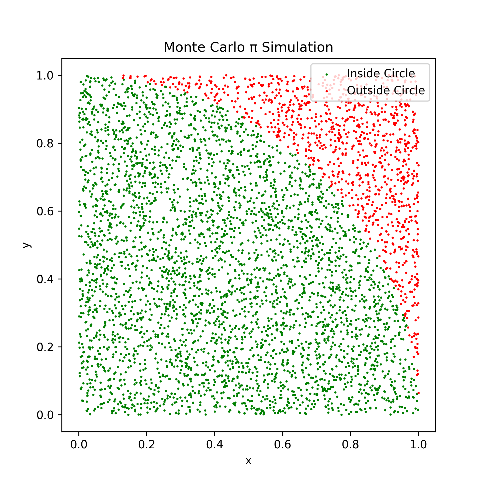

# Monte Carlo π Simulation

This project estimates the value of π using the Monte Carlo method. Random points are generated in a square, and the proportion that falls inside a unit circle is used to approximate π.

## Features

- High-performance simulation using **NumPy**.
- Visualization of points inside (green) and outside (red) the circle using **Matplotlib**.
- Portfolio-ready and easy to run.

## Screenshot



## How to Run

1. Make sure you have Python 3.x installed.
2. Install required libraries if you don’t have them:

```bash
pip install numpy matplotlib

Run the simulation:
python pi_simulation.py

You will see:

The estimated value of π printed in the terminal.

A plot showing random points inside and outside the circle.

Example Output
Estimated π with 1000000 points: 3.141592

Notes

For faster execution, the simulation uses 1,000,000 points but only plots 5,000 points for readability.

You can increase the number of points to improve accuracy.

